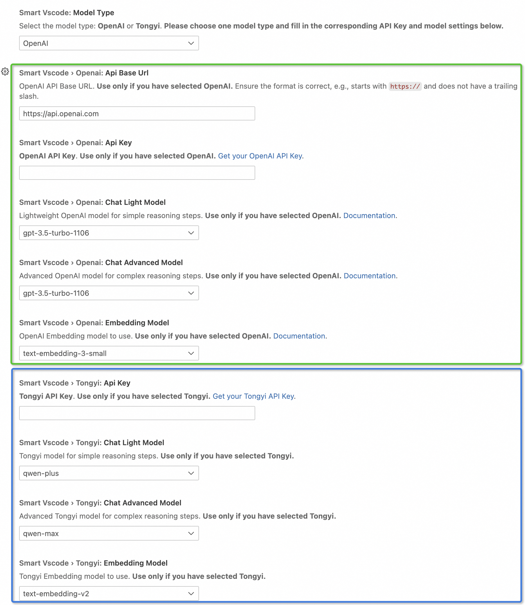

<h3 align="center"> SmartVscode: Controlling VS Code by natural language</h3>

## News
- **[2024-11-08]** We have now released the **SmartVscode** v1.0 version, it is based on [App-Controller](https://github.com/alibaba/app-controller) framework.

## What's SmartVscode?
**SmartVscode** aims to revolutionize how we interact with the powerful capabilities of Visual Studio Code by harnessing the simplicity and intuitiveness of natural language. Envision seamlessly toggling themes, connecting to remote servers, or even generate a mini-game — all articulated through natural language. This innovative method is designed to make coding more efficient and advanced, taking users into a new stage of interacting with software.

- 🔥 **Natural Language Command Interface**: Execute a wide array of VS Code commands simply by expressing your intention in natural language. No need to memorize complex command syntax or search through menus—let the plugin understand and act upon your instructions.

- ➕ **Automated Task Execution**: Streamline your development workflow with tasks automated by your descriptions. Whether you need to switch up your coding environment by changing themes and fonts or start a new project component like a mini-game, just ask and it's done.

- 📃 **Interactive Sidebar Conversations**: Engage in a dynamic conversation with your editor. Get instant responses right in your sidebar conversation window.

## Feature Video

### Tic-tac-toe Game

### A comprehensive pipeline in Python including configuration, code, and execution.

### Style Changing

### Theme Changing

  
## How to use
To begin utilizing this extension, follow these steps:
### Installation
1. Navigate to the Visual Studio Code Extension Marketplace.
2. Search for and install the extension.
### Add Model Config
Once the extension is installed:
- Locate the chat window titled "SmartVscode" in your left sidebar, which should resemble the following:

- Configure your model settings within the extension:
   - Access our settings by clicking "Settings" button:
   - For using OpenAI, select the model type to `OpenAI` and modify the settings in the green box as shown in the figure below, including: 
      - your `API base url` and `API key` 
      - your preferred `chat` and `embedding` models 
   - For using Tongyi, select the model type to `Tongyi` and modify the settings in the blue box as shown in the figure below, including: 
      - your `API key` 
      - your preferred `chat` and `embedding` models 

 

## Supported Tasks

SmartVScode intergrates a variety of built-in VSCode commands and settings that users can execute by entering simple language instructions. 
Here are some examples:

| **Editor**                        |                 |                    |
|--------------------------------------|---------------------------------------|----------------------------------|
| Scroll files together when I view multiple files at the same time | Enable the dimming of unfocused editors and terminals  |  Pin the current editor      |
| Fold all block comments  | Increase the font size in my editor to 16  |     Disable the tab preview mode to open a file in a new tab
| Open the global replace interface   | Show the name of the file followed by its relative path in the editor label  | ... ... |

| **File**                        | **Extension**                         |**Terminal**                        |
|--------------------------------------|---------------------------------------|----------------------------------|
| Compare the current file with the content I just copied to the clipboard | Install an extension from a .vsix file  | Enable the warning when paste multiple lines in terminal     |
| Enable auto-saving of files every 5 seconds   | Turn off the auto update for extensions  | Enable the bracketed paste mode in the terminal  |
| Go back to the previous location where my cursor was in the code   | Enable the automatic update check for extensions  | Navigate to the top of the the terminal view  |
| Enable the column selection   | Show me the extensions sorted by their names  | Increase the amount of scrollback kept in the terminal buffer to 2000   |
| Open the current file position in the system window  | Show me where the extensions are installed  | Show me which commands in terminal I've used recently           |
| ... ....   | ... ....   | ... ... |

| **Debug**                        | **Git**                         |**Setting**                        |
|--------------------------------------|---------------------------------------|----------------------------------|
| Add a contional breakpoint on the current line | Unstage the changes I staged in the current file  |  Open the global settings editor   | 
| Enable all the breakpoints |View the differences between the current version of my project and the last committed version  | Open the command list  |
| Show all the breakpoints in my project   | View the Git output to understand what's going wrong  | Open the keyboard shortcuts setting view  |
| ... ....   | ... ....   | ... ... |

| **WorkSpace**                        | **Wokrbench**                         |**Window**                        |
|--------------------------------------|---------------------------------------|----------------------------------|
| List all the symbols in my workspace | Help naviagte to warnings in my project  | Incease the zoom level of the editor       |
| I want to manage the trust setting for my current workspace   | Open the 'Customize Layout' dropdown for me   | Set VS Code to only restore the last window I worked on when I start a new session  |
| Close the current project folder   | Hide the sidebar for me to get a full view of my code  | Move hte current editor to a new window           |

## Documentation
[Documentation](https://alibaba.github.io/smart-vscode-extension/en/index.html) provides the comprehensive information on how to develop SmartVscode. You can refer to these documentations for an improved experience with SmartVscode.

## License
SmartVscode is released under Apache License 2.0.

