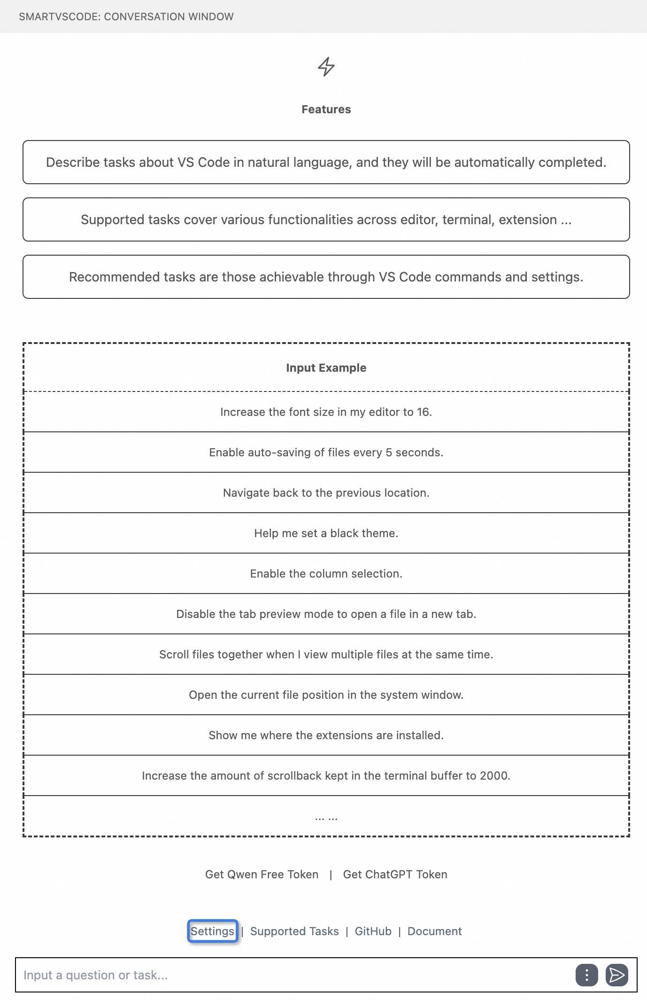

<h3 align="center"> SmartVscode: Controlling anything of Vscode by natural language</h3>

## News
- **[2024-06-27]** We have now released the **SmartVscode** v1.0 version, it is based on [App-Controller](https://github.com/alibaba/app-controller) framework.

## What's SmartVscode?
**SmartVscode** aims to revolutionize how we interact with the powerful capabilities of Visual Studio Code by harnessing the simplicity and intuitiveness of natural language. Envision seamlessly toggling themes, connecting to remote servers, or even generate a mini-game — all articulated through natural language. This innovative method is designed to make coding more efficient and advanced, taking users into a new stage of interacting with software.

- 🔥 **Natural Language Command Interface**: Execute a wide array of VS Code commands simply by expressing your intention in natural language. No need to memorize complex command syntax or search through menus—let the plugin understand and act upon your instructions.

- ➕ **Automated Task Execution**: Streamline your development workflow with tasks automated by your descriptions. Whether you need to switch up your coding environment by changing themes and fonts or start a new project component like a mini-game, just ask and it's done.

- 📃 **Interactive Sidebar Conversations**: Engage in a dynamic conversation with your editor. Get instant responses right in your sidebar conversation window (feature coming soon)

## Feature Video

### Tic-tac-toe Game

### Style Changing

### Theme Changing

### Enable auto saving

## Roadmap
- More supported capabilities of Vscode to called by natural language
- Supporting streaming response for user simple question.
- Introducing user feedback for task. 
- More beautiful UI view.
  
## How to use
To begin utilizing this extension, follow these steps:
### Installation
1. Navigate to the Visual Studio Code Extension Marketplace.
2. Search for and install the extension.
### Add Model Config
Once the extension is installed:
- Locate the chat window titled "SmartVscode" in your left sidebar, which should resemble the following:

- Configure your model settings within the extension:
   - Access the our settings by clicking "Settings" button:
   - For using OpenAI, input your API key and select your preferred chat and embedding models

 

## Supported Tasks
Here we provide an overview of the tasks supported by SmartVscode. More tasks will be supported quickly.

| Task                  | Input Example                                   |
| --------------------- | ----------------------------------------------- |
| **Settings**          |                                                 |
| Theme                 | Switch to dark theme                            |
| Font                  | Set font size to 14                             |
| Keybinding            | I want to set a shortcut key for saving as      |
| Color                 | Change the color of code comments to green      |
| **Editor**            |                                                 |
| Format                | Format this file                                |
| Format                | Format the selected code                        |
| Replace               | Replace "var" with "let"                        |
| Comment               | Comment the selected code                       |
| Comment               | Uncomment the selected code                     |
| Duplicate             | Duplicate the current line                      |
| Duplicate             | Duplicate the selected code                     |
| File                  | Open the file named "main.py"                   |
| Navigate              | Go to line 20                                   |
| Navigate              | Jump to the function "greet"                    |
| Navigate              | Navigate back to the previous location          |
| Fold                  | Collapse all sections in the current JSON file  |
| Fold                  | Unfold all sections in the current JSON file    |
| **View**              |                                                 |
| Workspace             | Open a workspace folder in a new window         |
| Workspace             | Close current workspace folder                  |
| Sidebar               | Close the sidebar on the left                   |
| **Execution**         |                                                 |
| Breakpoint            | Set a breakpoint at line 50                     |
| Debug                 | Start debugging                                 |
| Debug                 | Run the file named "main.py"                    |
| **Remote Connection** |                                                 |
| Config                | Open the remote configuration file              |
| Connection            | Create a remote ssh server connection in vscode |
| **Extension**         |                                                 |
| Install               | Install the extension named "python"            |

## Documentation
[Documentation](https://alibaba.github.io/smart-vscode-extension/en/index.html) provides the comprehensive information on how to develop SmartVscode. You can refer to these documentations for an improved experience with SmartVscode.

## License
SmartVscode is released under Apache License 2.0.

