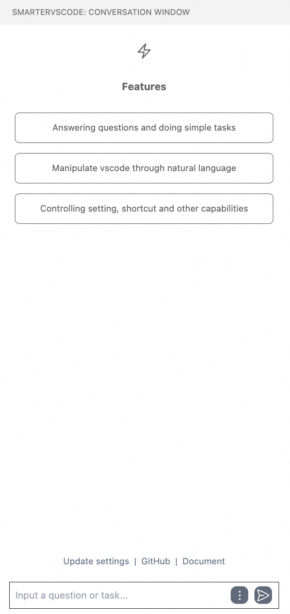
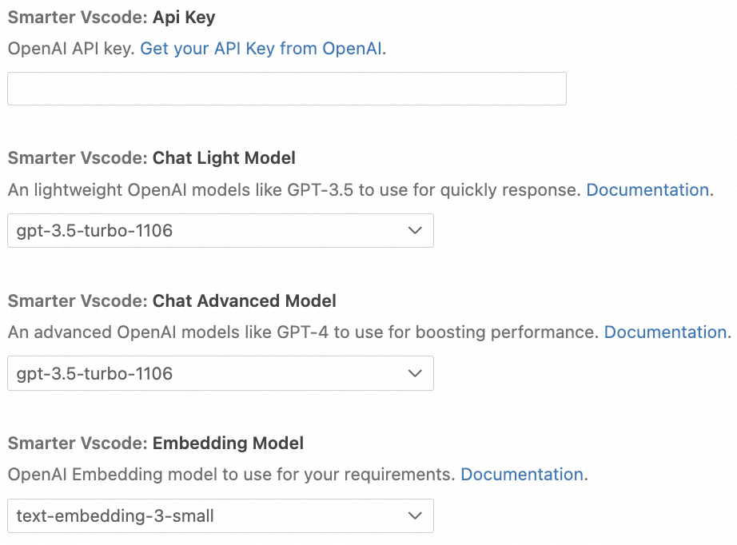
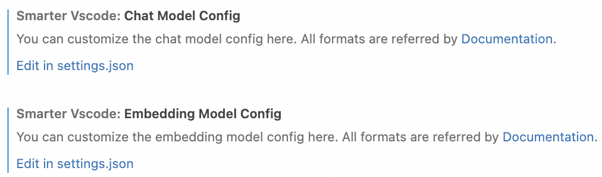

(installaion-en)=

# How to use
To begin utilizing this extension, follow these steps:
## Installation
1. Navigate to the Visual Studio Code Extension Marketplace.
2. Search for and install the extension.
## Add Model Config
Once the extension is installed:
- Locate the chat window titled "SmartVscode" in your left sidebar, which should resemble the following:
<p align="center"></p>

- Configure your model settings within the extension:
   - Access the our settings by clicking "Settings" button:
   - For using OpenAI, input your API key and select your preferred chat and embedding models
<p align="center"></p> 

   - For other AI models, like qwen, you should add the model configuration directly to your settings.json file, accessible via the "Edit in settings.json" button:
     - 
     -  All format for model config need to obey the [format](https://modelscope.github.io/agentscope/en/tutorial/203-model.html).
     - A example on using setting file to configure openAI model.
     - ```json
        "smartVscode.chatModelConfig": {
            "Lightweight": {
            "model_type": "openai_chat",
            "model_name": "your modelName",
            "api_key": "your apiKey",
            "client_args": {
                "base_url": "your baseUrl"
            }
            },
            "Advanced": {
            "model_type": "openai_chat",
            "model_name": "your modelName",
            "api_key": "your apiKey",
            "client_args": {
                "base_url": "your baseUrl"
            }
            }
        },
        "smartVscode.embeddingModelConfig": {
            "model_type": "openai_embedding",
            "model_name": "your modelName",
            "api_key": "your apiKey",
            "client_args": {
            "base_url": "your baseUrl"
            }
        }
        ```