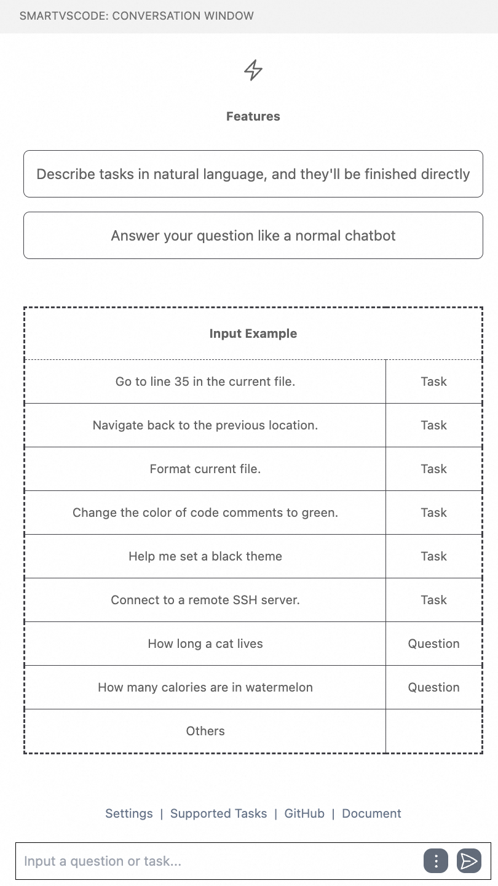

(installation-en)=

# How to use
To begin utilizing this extension, follow these steps:
## Installation
1. Navigate to the Visual Studio Code Extension Marketplace.
2. Search for and install the extension.
## Add Model Config
Once the extension is installed:
- Locate the chat window titled "SmartVscode" in your left sidebar, which should resemble the following:

- Configure your model settings within the extension:
   - Access our settings by clicking "Settings" button:
   - For using OpenAI, select the model type to `OpenAI` and modify the settings in the green box as shown in the figure below, including: 
      - your `API base url` and `API key` 
      - your preferred `chat` and `embedding` models 
   - For using Tongyi, select the model type to `Tongyi` and modify the settings in the blue box as shown in the figure below, including: 
      - your `API key` 
      - your preferred `chat` and `embedding` models 

 

   